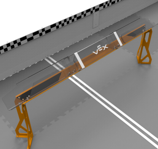
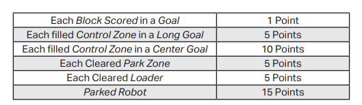
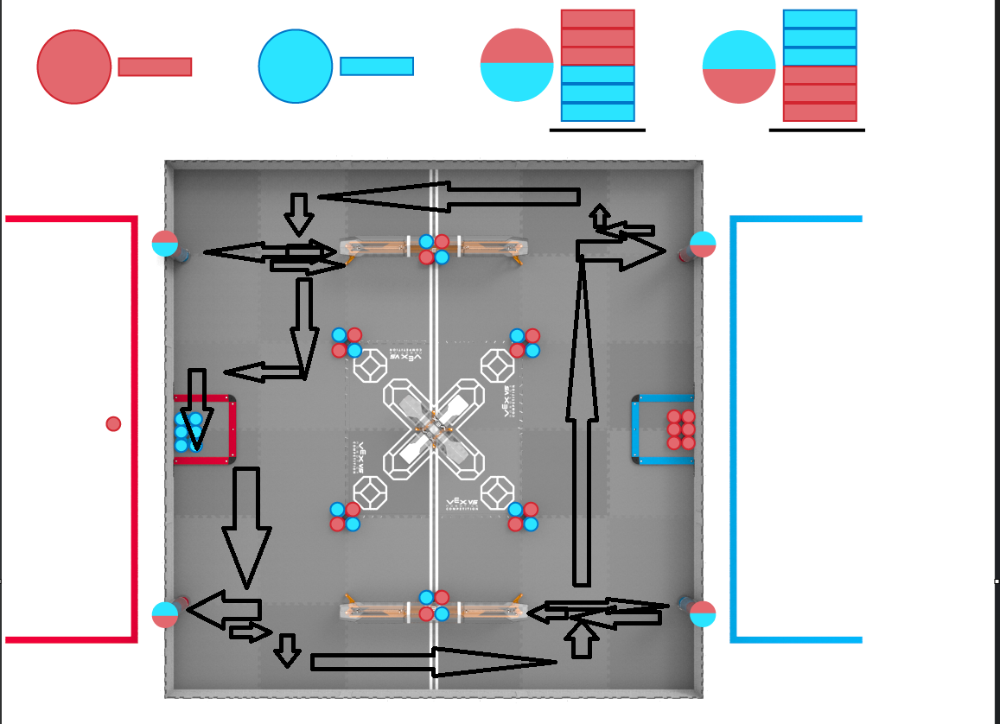
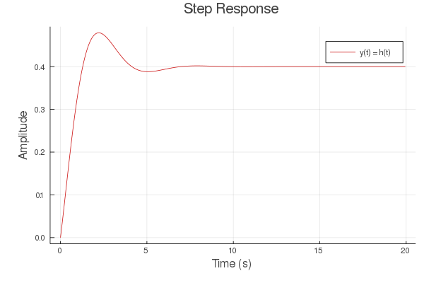
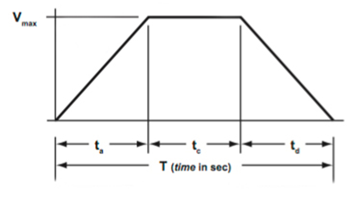

# 80550A Autonomous Skills

This program is for team 80550A Pi-Rates out of Windsor Charter Academy in Windsor, Colorado. It is for the 2025-2026 season for Vex V5 Highschool Competetive Robotics, known as PushBack. 

## Outine of Vex V5 and goals

The overview of the Robot Skills as provided by the RECF (Robotic Education Competition Foundation), the governing body of Vex V5 Competitive Robitcs, in [V3 of the Vex V5 Push Back Game Manual](https://content.vexrobotics.com/docs/25-26/v5rc-push-back/docs/PushBack3.0.pdf) states: "In this challenge, Teams will compete in sixty-second (one minute) long Matches in an effort to score as many points as possible. These Matches consist of Driving Skills Matches, which are entirely driver controlled, and Autonomous Coding Skills Matches, which are autonomous with limited human interaction. Teams will be ranked based on their combined score in the two types of Matches." 

This program focuses only on the Automous Coding Skills section. There are numerous ways to score points in skills namely by scoring the "blue and red 18-sided hollow plastic polygonal object", known as blocks, into the long goals (pictured below).

This program moves our physical robot on a 12ft x 12ft field, interacting with multiple ~3.25" x ~3.25" blocks along the way. 

## Routing

This image visualizes the rough path the robot will move. 

## Features

#### PID-Based Turning
Our robot uses a Proportion-Integral-Derivative (PID) control system to turn to a heading. This algorithim is meant to create a smooth curve (pictured below), which efficiently turns the robot to a heading. To get current heading, our program uses the Vex-Provided Inertial Sensor which is calibrated everytime the program is run. The specific tuning (kP, kD, kI) is different for every robot and condition, and will need to be adapted.    

An example of what a PID output may look like(note this curve is **not** adequately tuned):

#### Trapezoidal Motion Profiling
Our robot also uses a function to create forward/backward smooth movement. This algorithim creats intervals of velocity for the robot to move at, with an increasing, cruising, and decreasing interval to ensure accuracy and efficiency. 

An example of what the trapezoidal motion profile should look like:

#### Custom Odometry
Our robot needs to have an idea of how far it's travelled in order to accuractely move, hence we use Vex's built-in smart motor encorders (of which tell you how many degrees a motor has turned), to estimate the distance travelled. We do this by using math to convert the motor rotation to distance travelled using a wheel circumfrence to motor degrees ratio. 

## License

[MIT](https://choosealicense.com/licenses/mit/)